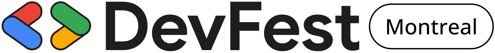

# DevFest Montreal 2025

This is a [Next.js](https://nextjs.org/) project for DevFest Montreal 2025, a premier developer festival that brings
together tech enthusiasts, developers, and industry experts for a day of learning, sharing, and networking.

## Table of Contents

- [About the Project](#about-the-project)
- [Built With](#built-with)
- [Getting Started](#getting-started)
    - [Installing Packages](#installing-packages)
    - [Running Locally](#running-locally)
    - [Running with Docker](#running-with-docker)
- [Updating Data](#updating-data)
    - [Using GitHub Codespaces](#using-github-codespaces)
- [Learn More](#learn-more)

## About the Project

DevFest Montreal 2025 is the largest annual developer conference in Montreal, featuring cutting-edge technical sessions,
hands-on workshops, and networking opportunities. This web application serves as the official platform for the event,
providing information about:

- Event schedule and session details
- Speaker profiles and presentations
- Team members and organizers
- Venue information
- Code of conduct
- Registration and tickets

## Built With

- [Next.js 15](https://nextjs.org/) - The React Framework for the Web
- [React](https://reactjs.org/) - A JavaScript library for building user interfaces
- [Tailwind CSS](https://tailwindcss.com/) - A utility-first CSS framework
- [next-intl](https://next-intl-docs.vercel.app/) - Internationalization for Next.js
- [Heroicons](https://heroicons.com/) - Beautiful hand-crafted SVG icons

## Getting Started

### Installing Packages

First, install the project dependencies:

```bash
npm install
# or
yarn install
# or
pnpm install
```

### Running Locally

Run the development server:

```bash
npm run dev
# or
yarn dev
# or
pnpm dev
```

Open [http://localhost:3000](http://localhost:3000) with your browser to see the result.

### Running with Docker

To run the project using Docker:

```bash
# Build the Docker image
docker build -t devfest-montreal .

# Run the container
docker run -p 3000:3000 devfest-montreal
```

## Updating Data

The site content is managed through JSON files located in the `src/locales` directory. The content is available in both
English and French.

### Content Structure

- `src/locales/en/` - English content
- `src/locales/fr/` - French content
- `public/images/` - Image assets

### Using GitHub Codespaces

This project is configured for development in GitHub Codespaces, providing a consistent development environment across
the team.

## Learn More

- [Next.js Documentation](https://nextjs.org/docs) - learn about Next.js features and API
- [DevFest Montreal](https://devfestmontreal.com) - official website
- [GDG Montreal](https://gdgmontreal.com) - our organizer community

## Contributing

We welcome contributions! Please read our contributing guidelines and submit pull requests.

## License

This project is licensed under the MIT License - see the LICENSE file for details.
